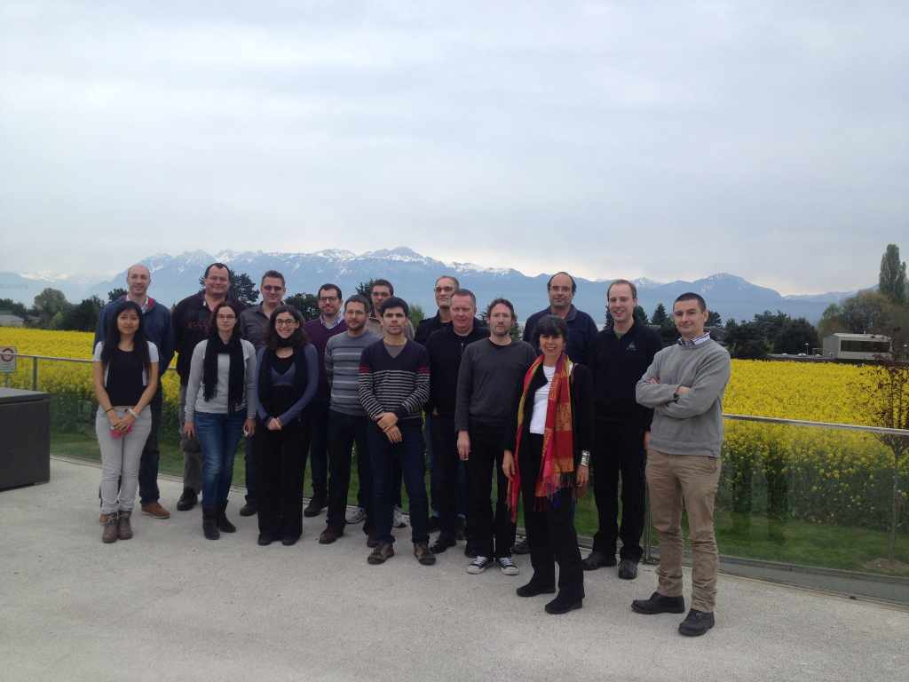

The third CoLoMoTo meeting took place in Lausanne at the Center for Integrative Genomics (CIG),
organised by Aurélien Naldi, Claudine Chaouiya and Ioannis Xenarios.

# Schedule

## Thursday, 17: software tools and exchange formats

Time   | Who                   |  Topic
-----  | -------------------   | -------------------------------------------------------------------
09:00  |                       |  Welcome and introduction
09:30  | A Naldi               |  [GINsim](01_GINsim.pdf)
10:00  | C Müssel, H Kestler   |  [BoolNet](02_BoolNet.pdf)
10:30  | L Mendoza             |  [SQUAD](03_SQUAD.pdf)
11:00  | T Helikar             |  [the Cell Collective](04_theCellCollective.pdf)
11:30  | P Varela              |  [EpiLog](05_Epilog.pdf)
12:00  |                       |  Lunch break
14:00  | P Monteiro            |  [Attractors identification and quantification](06_avatar.pdf)
09:15  | T Cokelaer            |  [CellNOpt](07_CellNOpt.pdf)
15:00  | C Chaouiya, A Naldi   |  [SBML qual package & SED-ML](08_SBML_qual.pdf)
15:30  | A Dräger              |  [JSBML](09_JSBML.pdf) 
16:00  |                       |  Discussion, working session

## Friday, 18: methods and discussion

Time   | Who                   |  Topic
-----  | -------------------   | -------------------------------------------------------------------
09:30  | H Klarner             |  [On the Generalization of Fixpoints of Boolean Networks](10_fixedpoints.pdf)
10:00  | P Monteiro            |  [Model-checking applied to logical models](11_input-model-checking.pdf)
10:30  | C Chaouiya            |  [A Discrete Model of Drosophila Eggshell Patterning](12_Droso_EggShell_Patterning.pdf)
11:00  | L Calzone, G Stoll    |  [Continuous time modelling with MaBoSS. Application to bladder tumorigenesis](13_MaBoss.pdf)
11:30  |                       |  Discussion
12:00  |                       |  Lunch break
14:00  | A Naldi               |  [LogicalModel library, current status](14_LogicalModel.pdf)
14:30  |                       |  Discussion, CoLoMoTo future (community, scope, founding, etc.) 

# Discussions

Aside from presentations, enough time to let the discussion run over allowed the participants to address a number of points and make some decisions about future actions. This meeting enabled the discussion between all the participants in order to establish the goals and pillars of the CoLoMoTo consortium, as well as funding strategies for its future sustainability. Outcomes of these discussions are synthesised below.

## What is CoLoMoTo?

CoLoMoTo stands for Common Logical Modelling Toolbox.
It is an international open community interested in Logical Modelling, bringing together modellers, developers of methods and tools, and curators.

## What are the goals of CoLoMoTo?

The goals of CoLoMoTo are two-fold.
First, the CoLoMoTo community aims at the definition of standards for model representation and interchange; and at the establishment of criteria for comparison of methods, models and tools.
Secondly, making people outside the community aware of the existing models, methods and tools from which they can build upon their research.

## What are the main pillars of CoLoMoTo consortium?

In this meeting, the CoLoMoTo consortium identified four pillars to stand upon.
Each of these pillars is representative in some way of the work done by the community interested in logical modelling.

The **first pillar** is to create a repository of methods and tools made available by the different research groups working on logical modelling. This repository not only lists the different features and functionalities provided by each of the tools and methods, but also provides a cross reference of tools and methods that better fit typical use-cases.

The **second pillar** is to create an umbrella model repository with links to the existing model repositories that are made available by the different research groups. Authors should be encouraged to make their models available at one of these repositories.

The **third pillar** relates to standardisation. It aims at creating a controlled vocabulary as a reference for the community.This vocabulary is to list the essential terms related to logical modelling, with verbal definitions and corresponding references.
Additionally, for the reproducibility of results, it defines (or extends) standards for the representation and interchange of models, their simulation parameters. 

The **fourth pillar** is to provide benchmarks for models and tools comparison. Also, to gather success modelling stories resulting from the collaboration between experimentalists and modellers.

## Task Forces

In order to best achieve the goals mentioned above, task forces were voluntarily created as follows:

**First Pillar (Methods & tools)**: Aurélien Naldi, Gautier Stoll and Pedro Monteiro

**Second Pillar (Models)** Tomas Helikar, Aurélien Naldi, Ioannis Xenarios, also to be contacted BioModels team (Henning Hermjakob)

**Third Pillar (Standards)** : Hannes Klarner, Denis Thieffry and Claudine Chaouiya

**Fourth Pillar (Benchmarking)**: Hannes Klarner, Pedro Varela, Christoph Müssel, Isaac Crespo

## Web site

An upgrade to the webpage was proposed, independent of Combine. Pedro Monteiro and Aurélien Naldi are working on it. The site (colotomo.org) will include
the tool repository (pillar 1)
the models repository (pillar 2)
adopted formats (link to SBML-qual) and controlled vocabulary (pillar 3)
benchmarks (pillar 4)
It will also provide outcomes of the CoLoMoTo meetings, groups descriptions accompanied by a “google map” (users and developers, links to short group descriptions). The idea is to let people know about CoLoMoTo and identify who are using and referring our tools. 

## Other outcomes

Besides the achievement of the pillars, other decisions were taken during the meeting:
Submission of a 2-3 pages position paper, making a statement about the importance of logical models. Aurélien Naldi, Christoph Müssel and Pedro Monteiro will take the lead on this.
Matteo Barberis and Tomas Helikar will propose a special issue to Frontiers Systems Biology. This SI would gather papers from each contributing group and a collective paper presenting CoLoMoTo, etc. (could be the aforementioned position paper)
If appropriate, the meeting report will be submitted for publication, possibly in the form of a letter (before summer).
It was also mentioned that resulting outcomes of the four pillars may result in publications (e.g. a global comparison of tools and methods). 

Aurélien Naldi proposed to advance with the conversion of multi-valued to Boolean models (LogicalModel library). This implies that tools using resulting models will handle them appropriately (forbidden states).
A working group (still to be defined!) will advance with a proposal for standardized ways of defining perturbations, probabilistic Boolean models, and delays. In particular, inclusion of delays as well as consideration of several alternative logical functions associated to a model component were discussed as possible extensions to SBML qual. 

## Funding

Funding was also a topic on this meeting. The creation of standards and achievement of the goals defined in the pillars leads to funding. Creating a brand, located on many sites, avoiding just one group to be represented, making CoLoMoTo an umbrella entry point. Colomoto.org would be the structure where all data is compared. 

Several funding options were evoked, such as BD2K (Big data to knowledge), Cost Actions and the Gates foundation. Also ITNs (International training networks), funds PhD students to spend time at labs abroad.
Tomas Helikar will get information about the USA-UK funding opportunity via the NSF/UK partnership (http://www.nsf.gov/pubs/2014/nsf14034/nsf14034.jsp), which focus is also on Systems Biomedicine and coordinate future action with Julio Saez-Rodriguez at EBI.

## ECCB

We will be present at ECCB’14 (http://www.eccb14.org/) with a workshop (W08 - Logical Modelling and Analysis of Cellular Networks) and a tutorial (T02 - Computational Tools to Define and Analyse Logical Models of Cellular Networks).

# Participants

* Matteo Barberis (University of Amsterdam)
* Laurence Calzone (Institut Curie, France)
* Claudine Chaouiya (IGC, Portugal)
* Anastasia Chasapi (SIB, Switzerland)
* Thomas Cokelaer (EBI, UK)
* Isaac Crespo (SIB, Switzerland)
* Julien Dorier (SIB, Switzerland)
* Corina Dueñas Roca (Medical University of Warsaw)
* Tomas Helikar (University of Nebraska-Lincoln, US)
* Celine Hernandez (SIB, Switzerland)
* Hans Kestler (Medical Systems Biology, University of Ulm, Germany)
* Hannes Klarner (AG Biomathematics, FU Berlin, Germany)
* Luis Mendoza (UNAM, Mexico)
* Christoph Müssel (Medical Systems Biology, University of Ulm, Germany)
* Pedro Monteiro (INESC-ID & IGC, Portugal)
* Aurélien Naldi ( CIG - UNIL, Switzerland)
* Gautier Stoll (INSERM, UMR 1138, Eq. G. Kroemer, France)
* Denis Thieffry (ENS-IBENS, France)
* Pedro Varela (IGC, Portugal)
* Ioannis Xenarios (SIB, Switzerland) 

Remote participants:

* Andreas Dräger (UCSD, US) 
* Julio Saez-Rodriguez (EMBL-EBI, Cambridge UK)

# Funding and Acknowledgements

[SIB (Swiss Institute of Bioinformatics)](http://www.isb-sib.ch) and [SystemsX.ch (Swiss Research Initiative in Systems Biology)](http://www.systemsx.ch).

