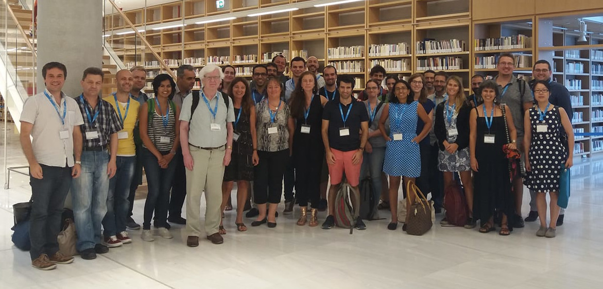

Anna Niarakis and Denis Thieffry organized a one-day workshop dedicated to Logical Modelling in the context of the
[European Conference on Computational Biology](http://eccb18.org).
This workshop took place in Athens on September 08, before the main ECCB conference (September 09-12).
More details are available on the [workshop page](http://eccb18.org/workshop-6).

## Summary

Logical models have long been used to explore the dynamical behaviours of regulatory networks.
This workshop provides an overview of recent methodological developments and applications on the
use of the logical formalism for the modelling of regulatory networks, covering the following main topics:

* Computational methods: attractor identification, model-checking, reduction techniques, network inference
* Modelling tools: GINsim, CellNetOpt, boolSim, MaBoSS, CellCollective, EpiLog, ...
* Biological applications: signalling networks, cell differentiation, cell reprogramming

The workshop was split in two sessions: the first session is dedicated to recent methodological developments,
the second session to biological case studies. Each of these sessions includes one introductory talk.
It is further articulated with a tutorial organized by Tomas Helikar and Juilee Thakar on Sept 9th, 2018,
thereby forming a two-days long SIG meeting devoted to logical modelling of cellular networks.

## Schedule and slides

| Time   | Speaker                 |  Topic
| ------ | ----------------------- | --------------------------------------------------------
| 09h00  |  A Niarakis             |  Welcome and introduction to the workshop
|        | C Chaouiya (chair)      | **Session I: Methods and tools**
| 09h10  | L Tournier              | [Interconnections of asynchronous Boolean networks with biological applications](ECCB18_W6_Tournier.pdf)
| 09h40  | E Gjerga                | [Advances in computational methods for the modelling of signalling networks](ECCB18_W6_Gjerga.pdf)
| 10h00  | L van der Zee           | Deciphering yeast physiology by a multi‐scale framework integrating cell cycle and metabolism
| 10h20  | L Paule                 | [Boolean Networks: Beyond Generalized Asynchronicity](ECCB18_W6_Pauleve.pdf)
| 10h40  |                         | Coffee/tea break
|        |  I Xenarios (chair)     | **Session II: Methods and tools.**
| 11h10  | L Sun                   | [Logical modelling: Inferring structure from dynamics](ECCB18_W6_Sun.pdf)
| 11h30  | A Niarakis              | [Automated pipeline for the inference of Boolean models from molecular interaction maps](ECCB18_W6_Niarakis.pdf)
| 11h50  | C Réda & B Wilczynski   | [Automated Inference of Gene Regulatory Networks Using Explicit Regulatory Modules](ECCB18_W6_Reda.pdf)
| 12h10  |                         | Lunch break
|        | M Barberis (chair)      | **Session III: Applications.**
| 13h30  | I Koch                  | [Concepts for functional analysis of signaling pathways in complex networks based on Manatee invariants](ECCB18_W6_Koch.pdf)
| 14h00  | C Hernandez             | [Dynamical modelling of T cell co-inhibitory pathways to predict anti-tumour responses to checkpoint inhibitors ](ECCB18_W6_Hernandez.pdf)
| 14h20  | J Dorier                |  Integrative logical and experimental modeling: application to macrophage phenotype transition
| 14h40  | G Selvaggio             | [Logical modelling and analysis of cell adhesion properties along Epithelial to Mesenchymal Transition](ECCB18_W6_Selvaggio.pdf)
| 15h00  |                         |  Coffee/tea break
|        | A Niarakis (chair)      | **Session IV: Applications.**
| 15h20  |  FM Khan                | [Identification of Diagnostic and Therapeutic Markers in Tumor Invasion using Logic-based Modeling](ECCB18_W6_Khan.pdf)
| 15h40  | A Montagud              | [Patient-specific prostate logical models allow clinical stratification of patients and personalized drug treatment](ECCB18_W6_Montagud.pdf)
| 16h00  | L Benoodt               | Dysregulated signaling networks implicated in vascular aging of HIV+ subjects investigated by logical modeling
| 16h20  | A Siegel                | [Learning Boolean regulations of a metabolic network: a case-study](ECCB18_W6_Siegel.pdf)
|        |                         | **Conclusions, discussion & drinks**

# Participants

