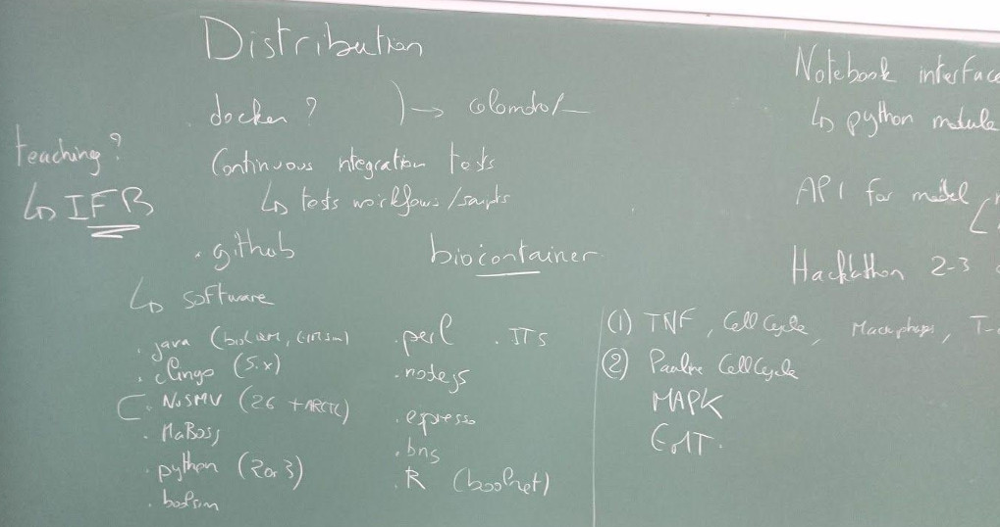
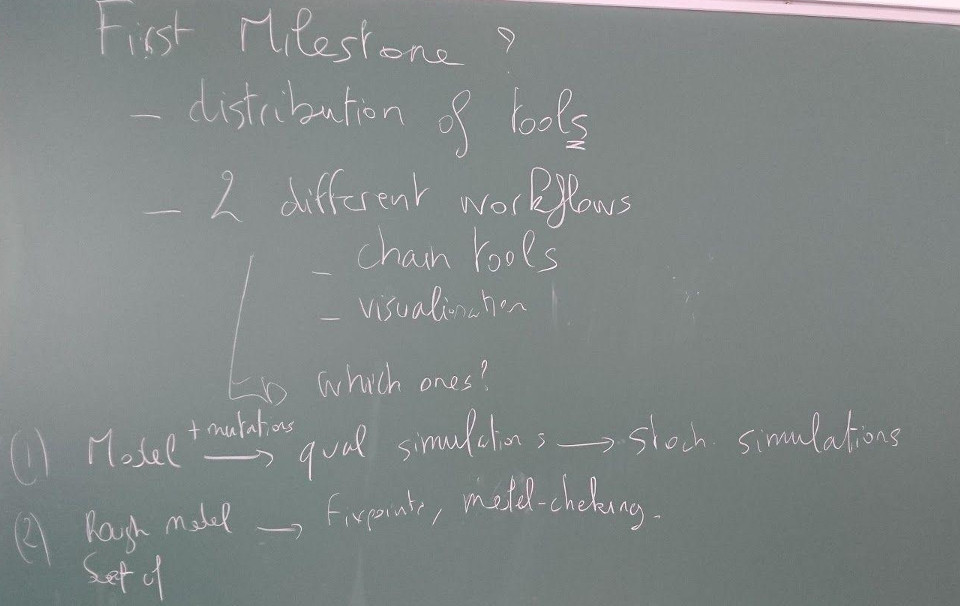
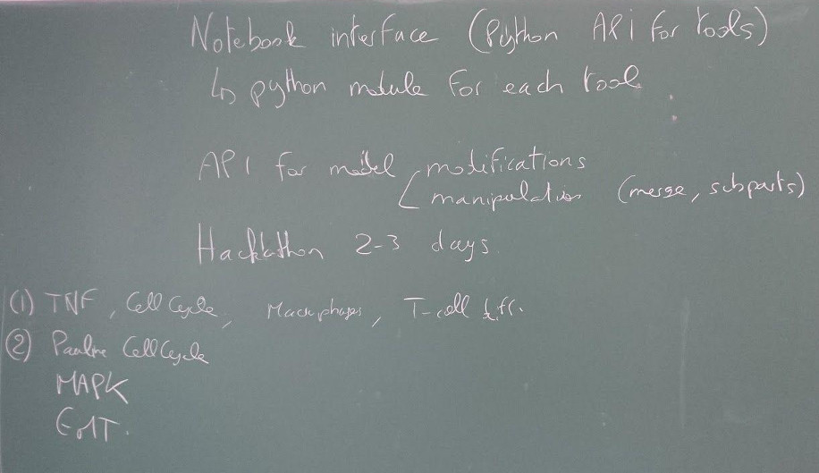
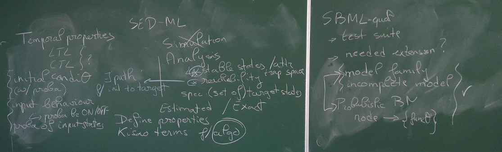

The fourth CoLoMoTo meeting took place in Paris, from the 17th to the 19th of July, 2017.
As usual, the meeting covered a wide range of topics related to logical modelling,
from methodological and software developments to biological applications.
It was hosted by IBENS in the center of Paris (46 rue d'Ulm).

This meeting was organized by
Aurélien Naldi (IBENS, Paris),
Claudine Chaouiya (IGC, Lisbon),
Denis Thieffry (IBENS, Paris),
Gautier Stoll (INSERM, IGR, U. Paris Descartes),
and Laurence Calzone (Curie Institute, Paris).

## July 17 - Scientific Presentations

Time   | Who                   |  Topic
------ | --------------------- | --------------------------------------------------------
13:00  |                       |  **Introductory remarks**
13:20  | **Gautier Stoll**     |  [Using MaBoSS for modeling heterogeneous cell behavior](Stoll_maboss.pdf)
13:40  | **Samuel Collombet**  |  Deciphering the regulatory network of blood cells specification and reprogramming
14:00  |                       |  *Coffee Break*
14:30  | **Loïc Paulevé**      |  [Modelling and analysis of transient dynamics of qualitative models](Pauleve_Pint.pdf)  ([tutorial](pint-tutorial.pdf))
14:50  | **Enio Gjerga**       |  [Efficient modelling of signalling networks derived from mass spectrometry phosphoproteomic data using Integer Linear Programming](Gjerga_ILP.pdf)
15:10  | **Ping Zhang**        |  Control and Diagnosis of Boolean Networks
15:30  |                       |  *Coffee Break*
16:00  | **Anna Niarakis**     |  [Integrative modelling and analysis of molecular pathways involved in Rheumatoid Arthritis](Niarakis_RA.pdf)
16:20  | **Arnau Montagud**    |  [Conceptual and computational framework for logical modelling of deregulated biological networks](Montagud_pipeline.pdf)
16:40  | **Claudine Chaouiya** |  [Standards for logical models: current status of SBML qual & SED-ML](Chaouiya_standards.pdf)
17:00  |                       | **Discussion - planning workgroups** 

## July 18 - Working groups and Presentations

Time   | Who                   |  Topic
------ | --------------------- | --------------------------------------------------------
09:00  |                       | **Working group on tooling**
-      | **Aurélien Naldi**    | [Model conversion, modification, and analysis with bioLQM](Naldi_bioLQM.pdf)
-      | **Loïc Paulevé**      | Jupyter Notebook
-      | **Claudine Chaouiya** | Future extensions to SBML qual and SED ML
12:30  |                       | *Lunch break*
13:30  |                       | **Working group on applications**
-      | **Laurence Calzone**  | Model composition
-      | **Gautier Stoll**     | Modelling the immune system
15:30  |                       | **Working group on methods**
-      | **Pedro T. Monteiro** | [On the structure and robustness of gene regulatory network Boolean functions](Monteiro_functions.pdf)
-      | **Adrien Fauré**      | [A circuit-preserving mapping from multilevel to Boolean dynamics](Faure_circuits.pdf)
-      | **Aurélien Naldi**    | [Trap-spaces and global reachability mapping](Naldi_trapspaces.pdf)
17:30  |                       | **Wrapping-up**

## July 19 - Wrapping up and hacking

Time  |  Topic
----- | ----------------------------------
10:00 |  MaBoSS Tutorial
10:00 |  Docker session 
12:00 |  **Discussion and Wrapping-up**

# Summary of discussions

## Tool integration & distribution

Discussion moderated by Loïc Paulevé

Aim: share and reproduce computational systems biology workflows

Objectives:

* Provide a joint distribution of tools for computational systems biology, developed by CoLoMoTo members and others, using Docker image(s).
* Provide (and advertise) an interface to write and document model analysis workflows, which typically rely on several tools, using the Jupyter notebook web interface.

We also discussed teaching aspects, and potential publications.

### CoLoMoTo Docker

Docker is used in many cloud environments, including data science and bioinformatics, to promote accessible and reproducible software (see for instance the BioContainers project).
Docker provides a container system, which makes easy to provide complete environments for running executables. On Linux, it does not require any virtualisation, hence have no performance drop. On Mac OSX and Windows, it can exploit latest virtualisation technologies embedded in processors to minimise the overhead.
Once the docker system is installed on the machine, installing and running a docker image can be done with a single command.

Our objective is to provide a docker image including the main software tools for manipulating and analysing logical models of biological networks. It may include, for instance, BioLQM, EpiLog, GINsim, clingo, MaBoSS, NuSMV, Pint, Boolsim, Node.JS, bns, Boolnet, espresso, etc.

Such an image will be useful in two main use cases:

* People can use this image to execute the provided tools avoiding installation/maintenance burden;
* The docker image will also provide an interactive web interface to write and document model analysis workflows, for example using the Jupyter notebook.

### Actions taken, status of the project

* A github project for building the Docker image has been created by Loïc, Aurélien, Céline and Pedro at
  https://github.com/colomoto/colomoto-docker.
  The image currently includes GINsim, BioLQM, Pint, MaBoSS, NuSMV and NuSMV-ARCTL. More to come soon. The image also ships the Jupyter notebook.
  Demos and examples will be produced in the coming months.
* The docker image colomoto/colomoto-docker is available at https://hub.docker.com/r/colomoto/colomoto-docker.
  It is automatically built from the github repository.
* A documentation on how to include and maintain new tools will be added soon.
* Future directions include the integration of systematic tests to ensure image consistency (test workflows / scripts).
* Céline wrote a SnakeMake workflow using the docker image and a preliminary sketch of Jupyter notebook, accessible at
  https://github.com/colomoto/colomoto-docker/tree/master/usecases.

### IPython Jupyter Notebook

Jupyter is an interactive web interface allowing to write notebooks combining code (python or R functions) and structured text for documentations.
See http://nbviewer.jupyter.org/github/pauleve/pint/blob/master/notebook/quick-tutorial.ipynb
for an example of notebook using GINsim and Pint.

A notebook consists in a single file that can shared and re-executed. Ultimately, one should be able to write a complete model workflow analysis in a single notebook, showing explicitly the full pipeline of tools and analysis parameters.

Although Python is the standard environment for Jupyter, a notebook can combine commands of different languages, including R.

Collectively, we aim to provide Python API for the tools shipped in the CoLoMoTo docker.
Writing a Python API for tools requires limited effort, as it may simply call the commands in the background with the appropriate parameters. The main work consists typically in returning python objects for the results, which enables further treatments of the results with other tools (through the python API), or with a standard library, for instance for data analysis and visualisation (e.g. using scipy, pandas, or matplotlib, just to name a few).

A typical workflow will often include a “manual” modification of a model, for instance, edge/node addition/removal. We could design an API to ease such modifications, e.g. through a dedicated python module to manipulate Boolean/multi-valued networks, or through some extension of the BioLQM script interface.

Other model manipulation to be considered include model merging, the handling of compartments, the integration of multicellular EpiLog grammar. These points would deserve further discussion.

User interface considerations: Jupyter allows to add custom menus and widgets (using javascript). Custom menus could help to launch pre-defined commands (see the Pint tutorial for an example), while custom widgets can ease the handling of command parameters.

*Proposed action*: organize a 2-3 days hackathon with developers of CoLoMoTo tools to define and implement python interfaces, ideally still in 2017. Loïc will send a message to the mailing to start preparing it.

### Demonstration

The docker image and Jupyter notebook capabilities should be demonstrated on at least two different workflows combining different tools.
Workflow proposals:

* Model + mutations -> qualitative simulations -> stochastic simulations: may rely on BioLQM, GINsim, and MaBoSS.
  Candidate models: Macrophages ; T-Cell differentiation ; TNF
* Rough model -> verification and filtering with stable states and model-checking: may rely on BioLQM, GINsim, Pint.
  Candidate models: Cell cycle ; EMT ; MAPK

Inspiration: SBML-qual paper, Curie workflow (Arnau Montagud), PNAS paper (Samuel Collombet).

### Teaching aspect

The question of the usage of Docker and Jupyter notebook in a teaching class environment has been raised by Denis.
Requiring students to install docker and pull the image (which may weigh several hundreds of megabytes) does not seem tractable.
However, one could rely on cloud infrastructures supporting Docker to provide an easy access to the tools: the student would simply have to connect to a given URL in order to write workflows through the Jupyter web interface.
In France, IFB can deploy Docker images and provide resources and access to students (this has been done already for courses using Jupyter notebook for bioinformatic tutorials).

### Publication

A paper for promoting the docker and the Jupyter notebook to ease the writing and sharing of computational systems biology workflows could be sent to Frontiers Research Topic on Logical Modeling of Cellular Processes: From Software Development to Network Dynamics (abstract 1st September, submission 1st February).
The paper may show an instantiation of the docker and Jupyter notebook on two workflows.

“Screenshots” of the discussion:

## SBML-qual and SED-ML

Discussion moderated by Claudine Chaouiya

### SBML-qual

* Test suite: We need to contribute with a test suite for SBML-qual (see http://sbml.org/Software/SBML_Test_Suite).
  This would fulfil the need for a service validating the correctness of interpretation of SBML-qual files.
* Support of Layout package: F. Bergmann (contact for the SBML-layout package) will be contacted to ask for the support of SBML-qual
  (i.e. QualitativeSpecies as a minimal requirement, we need to check what is needed for the interactions).
* Extensions of SBML-qual format
  
  * support for incomplete models as such,
  * support for families of models,
  * support for probabilities associated with the transitions (on top of the previous point?), to cover Probabilistic models à la Shmulevich.

A number of other possible extensions were discussed, but it was agreed to postpone their consideration. 

### SED-ML

It was agreed that simulation is one type of model analysis. For example, we will need to cover:

* Identification of stable states or trap spaces (independent of the updating scheme).
* Identification of attractors (dependent of the updating scheme, as cyclic attractors).
* Reachability properties requiring the specification of :

  * (set of) initial state(s) but also (set) of target state(s),
  * temporal properties (LTL and CTL).
  
* Probabilities associated with initial states.
* Definition of the behaviour of input components: e.g. (range of) probabilities associated with their values, switching values under specific conditions (see point 3.b), etc.
* Definition of model perturbations:

  * Override the ´model modification´as defined in SED-ML or not? The point is that it would be more convenient to rely on
    a simpler description of model perturbation: block the value of a node within an interval, block the value of a regulatory within an interval.
  * Apply model perturbations at a given simulation step (this is applicable for specific simulation settings such as synchronous or random asynchronous).
  * Make model perturbations stochastic, by associating a probability.
  
* In general, would it be possible to switch simulation parameters when reaching a state compliant with a certain condition (see point 3.b), or at a given step?
* For (part of) these settings, we may need to add new terms to the KISAO ontology, check if there is the notion of exact and estimated results,
  as some setting should lead always to the same specific results, other not (stochastic simulations).

## Model composition

Discussion moderated by Laurence Calzone 

Individual models have already been developed and validated. They can be found in the repository of GINsim, in CellCollective, and to a certain extent in BioModels. These individual models can be seen as modules of “cell cycle”, “apoptosis”, “DNA repair”, etc. The question is: when creating a new model, could we use existing models and, if so, how to assemble them?

There are two types of possible compositions:

* intracellular: pathways (or modules) within the cell,
* intercellular: different cell types interacting, or a population of interacting cells of the same type.

The idea of composing a model from already existing logical models poses several questions:

* how to deal with name conflicts: two models may have different naming for the same entity;
* how to deal with overlap: which part to use when two models have two different ways of writing rules;
* a model may provide details hidden behind a single interaction in the other model:
  EGFR in EMT model has a role in invasion and in cell cycle proliferation, which depends on the context;
* how to integrate external signals;
* how to preserve layout, which constitutes an important piece of information when constructing a regulatory network. 

We are aware that a software tool to compose models cannot fully automate the merging, but it should ease merging and suggest options for pending issues.

We could get some inspiration from the SBML-comp package to define the rules for composing two models.

To ensure the construction of comprehensive regulatory graph, when merging two models, we could test using OmniPath that all the connections between the nodes, that are found in other databases, are added to the composed model and annotated with publications.

The following proposed workflow/objectives emerged from the discussion:

* identify common components (referred to as interface nodes);
* keep track of the original rules;
* generate a default rule (i.e. join the original functions with an OR function?) and let the user edit the new rules if necessary;
* remember the modeller’s decision to formally define a merging strategy: keep track of all decisions to be able to come back to these
  rules if something does not fit in the model, or allow to change the rules for which the modeller was not confident at first
  when checking the sensitivity of the model.

Note that EpiLog has a grammar for simple integration functions, which could be extended to cope for more complex cases.

## Modelling the immune system

Discussion moderated by Gautier Stoll.

Immune system is a complex machinery, implying multiple signalling pathways in an heterogeneous environment. Understanding (part of) immune is a very important challenge in biology, with a lot of potential medical applications (infection, autoimmune diseases, cancer, etc.)

### Immune system parts that are modeled

Modeling the full immune system (including cell types and genes/proteins) is probably out of reach with the available tools. Nevertheless, some members of CoLoMoTo consortium are currently modelling subparts of the immune system:

* Th cells differentiation (Th, Treg, etc.),
* DC differentiation,
* Th cells activation and immune checkpoints,
* TCR (alpha+beta+) T cell selection.

### Phenotypes

It can be interesting to describe which phenotypes can be studied with the Logical Modelling approach:

* cell differentiation,
* cell selection (through cell death and proliferation),
* ligand ← → receptor interaction,
* spatial distribution; to keep the logical modeling philosophy, spatial effects could be modeled within discrete compartments.

One question arises: are these “phenotypes” really specific to the immune system? The answer is no, as each of them could be found in other biological processes. But it remains interesting to regroup immune system models, at least because modelers may have specific problems/results to share.

### Experimental data

There are specific methods for obtaining data to characterize the immune system:

* single cell characterization (cytometry, single cell RNA seq, etc.)
* transcriptome (micro-arrays, RNA-seq) within immune infiltrate estimation; this is an indirect method, for which different bioinformatics tools exist;
* ...

### Methods

Logical Modelling widely applied to signaling pathways. For the immune system, modelers use the following approaches:

* Boolean modeling and attractor identification,
* Probabilistic Boolean networks,
* Agent-based modeling.

# Participants

* Adrien Fauré	    (Yamaguchi University)
* Anna Niarakis	    (Université d'Evry Val d'Essonne)
* Arnau Montagud	(Institut Curie)
* Aurélien Naldi	(IBENS)
* Célia Biane	    (UEVE, IBISC Lab)
* Céline Hernandez	(IBENS)
* Claudine Chaouiya	(Instituto Gulbenkian de Ciência)
* Daniela Ferretti	(University of Camerino)
* Delphine Potier	(CIML)
* Denis Thieffry    (IBENS)
* Élisabeth Remy	(CNRS)
* Enio Gjerga	    (JRC COMBINE, RWTH Aachen University)
* Gautier Stoll	    (INSERM U1138eq11/Université Paris 5/Gustave Roussy)
* Geoffray Brelurut	(IBENS)
* Ghislaine Morvan-Dubois	(CNRS)
* Hugues Mandon	    (INRIA - LSV - LRI)
* Laurence Calzone	(Institut Curie)
* Loïc Paulevé	    (CNRS/LRI)
* Nathalie Lehmann	(IBENS)
* Paolo Ballarini	(CentraleSupelec)
* Pauline Traynard	(Institut Curie)
* Pedro T. Monteiro	(INESC-ID/IST - Universidade de Lisboa)
* Ping Zhang	    (University of Kaiserslautern, Institute of Automatic Control)
* Samuel Collombet 	(IBENS)
* Samyadeep Basu	(IBENS)
* Seraya Maouche	(TBi Scientific)
* Swann Flochlay	(IBENS)
* Tomas Helikar	    (University of Nebraska)
* Vidisha Singh	    (Genhotel, University of Evry val d'essonne)
* Wassim Abou-Jaoude

